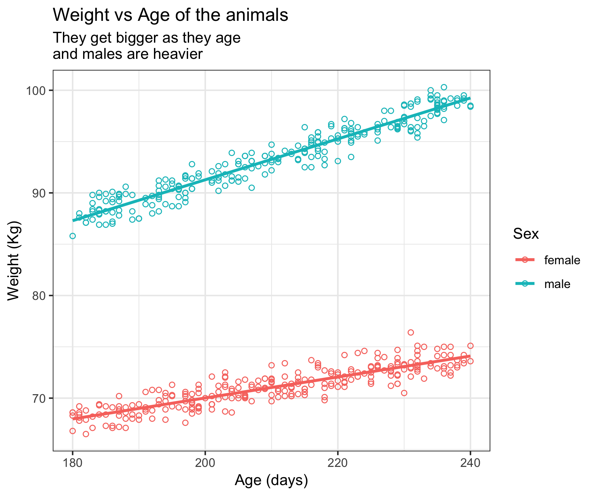

```{css, echo=FALSE}
/* custom.css */
.left-code {
  color: #777;
  width: 38%;
  height: 92%;
  float: left;
}
.right-plot {
  width: 60%;
  float: right;
  padding-left: 1%;
}
.plot-callout {
  height: 25%;
  width: 30%;
  top: 10%;
  right: 5%;
  position: absolute;
}
.plot-callout img {
  width: 100%;
  border: 1px solid #EEEEEE;
}

code.r.hljs.remark-code{
  background-color: #E0E0E0;
}
```

```{r, include= FALSE}
library(tidyverse)
library(here)
library(knitr)

set.seed(42)

opts_chunk$set(comment = "")

dat <- read_csv(here("logreg_course", "logreg_data_01_20190530.csv"))
```


# Learning Outcomes

- __Refresher__ on logs, odds, probability and linear regression
- Understand why linear regression not sensible for __binary data__
- Explain how __logit__ and binomial model let us __extend linear regression__
- Be able to run a __simple logistic regression in R__
- Be able to explain basic R glm __output__
- Be able to explain __estimates__ with categorical and continuous variables
- Explain __significance test results__ on variables
- Explain that __assumes linear in log odds__ in v basic terms - why it matters
- __Know where to go next!__

---
# But first - some R

```{r, eval = FALSE}
library(tidyverse)
library(usethis)
library(boot)
library(skimr)

use_course("XXXX")

dat <- read_csv("logreg_data_01_20190530.csv")

skim(dat)
```


---


# Logarithms ('logs')

Can we skip this bit?

--
$$log_{10}(10)=1$$
--
$$log_{10}(1000)=3$$
--
$$log_{10}(0.01)=-2$$
--
We can have other bases e.g. $e$

$$log_e(2.718)\simeq1$$
--
And reversing this...
--
$$10^3=1000$$

$$e^2\simeq7.389$$
---

# Odds and probability

__Probabilities__ have values from 0 ('never happens') to 1 ('always happens')

__'events of interest' ÷ 'all events'__

--

What is the probability that a fair coin  lands on heads?

--

$$1/2 = 0.5$$

--

What is the probability that a 6 sided die 🎲lands on 4?

--

$$1/6 \simeq 0.166$$

--

__Odds__ have values from 0 ('never happen') to infinity ('always happens')

__'events of interest' ÷ 'other events'__

--

What is the odds that a fair coin  lands on heads?

--

$$1/1 = 1$$

--

What is the odds that a 6 sided die 🎲lands on 4?

--

$$1/5 = 0.2$$


---

# Linear regression

.left-code[
- numerical outcome
- numerical / categorical predictors
- linear relationship
]


.right-plot[
```{r, echo = FALSE, dev='svg'}
ggplot(dat) +
  aes(age, weight, colour = sex) +
  geom_point(shape = 1) +
  geom_smooth(method = "lm", se = FALSE) +
  theme_bw(base_size = 22) +
  labs(title = "Weight vs Age of the animals",
       subtitle = "They get bigger as they age\nand males are heavier",
       x = "Age (days)",
       y = "Weight (Kg)",
       colour = "Sex")
```

```{r, include = FALSE}
ggsave(here("figures", "lin_regression_plot.png"))
```
]
---
# Linear regression in R

.plot-callout[

]

```{r, echo = FALSE}
mod1 <- lm(weight ~ age + sex, data = dat)
print(summary(mod1), digits = 2)
```

---

# Analysing binary data

### Binary data common in epidemiology e.g.

- alive/dead
- healthy/diseased


```{r, echo = FALSE}
dat %>% 
  sample_n(6) %>% 
  kable(format = "html", caption = "Example data")
```

---

# Univariable analysis

__Status vs treatment__

```{r, echo = FALSE}
dat %>% 
  count(treatment, status) %>% 
  spread(status, n) %>% 
  kable(format = "html")
```

```{r}
with(dat,
     {{fisher.test(status, treatment)}})
```

---

# Multivariable analysis

How about recoding the outcome as 0/1?

```{r, echo = FALSE}
set.seed(42)
dat <- dat %>%
  mutate(status01 = as.numeric(factor(status, levels = c("healthy", "diseased"))) - 1)

dat %>% 
  sample_n(6) %>% 
  kable(format = "html", caption = "Example data")
```

Then use linear regression...

---

# Linear regression 1

```{r, echo = FALSE, dev = 'svg', fig.height=4}
ggplot(dat) +
  aes(age, status01, colour = treatment) +
  geom_point(shape = 1) +
  theme_bw(base_size = 16) +
  scale_y_continuous(limits = c(-0.2, 1.0), breaks = c(0,0.5,1)) +
  labs(title = "Status vs Age and treatment",
       x = "Age (days)",
       y = "Outcome",
       colour = "Treatment")

```

---

# Linear regression 2

```{r, echo = FALSE, dev = 'svg', fig.height=4}
last_plot() +
  geom_smooth(method = "lm", se = FALSE, lwd = 0.5)
```

--

### Problems

--

-predicts (impossible) intermediate values

--

-can predict <0 and >1

---

class: inverse, middle, center

# Worked example

---


