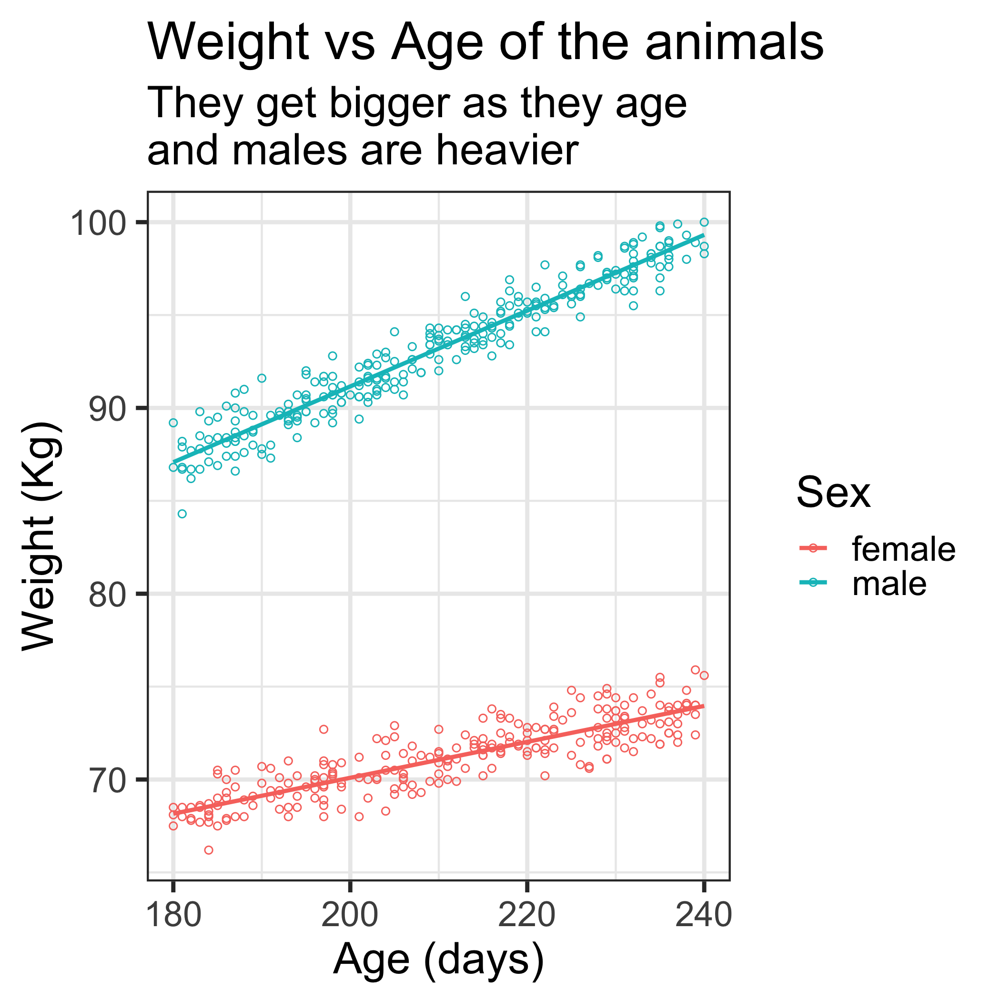

```{r setup, include=FALSE}
knitr::opts_chunk$set(echo = TRUE)
```


```{r, include= FALSE}
library(tidyverse)
library(here)
library(knitr)
library(kableExtra)
library(broom)
library(sjPlot)

set.seed(42)
opts_chunk$set(comment = "", error = FALSE)

purple <- "#CAB2D6"
```

# Introduction

These notes are a basic introduction to binary logistic regression used to analyse data with binary - yes/no - outcomes.

In these notes we'll aim to cover the following learning outcomes:


* __Refresher__ on logs, odds, probability and linear regression
* Understand why linear regression not sensible for __binary data__
* Explain how __logit__ and binomial model let us __extend linear regression__
* Be able to run a __simple logistic regression in R__
* Be able to explain basic R glm __output__
* Be able to explain __estimates__ with categorical and continuous variables
* Explain __significance test results__ on variables
* Introduce some basic ideas for __selecting variables and models__
* __Things to watch out for!__
* __Know where to go next!__

# Prerequisites

We'll cover a couple of background topics but to follow these notes you'll need to be able to load packages in R, run simple code in R and have a basic understanding of linear regression and statistical hypothesis tests. To run the R code in these notes you'll need to load in the example data-set and have a few packages downloaded and loaded into your R session.

Downloading the packages (you only need to do this if you haven't already downloaded them)

```{r eval = FALSE}
install.packages("tidyverse")
install.packages("boot")
install.packages("broom")
install.packages("skimr")
install.packages("sjPlot")
```

Loading the packages...

```{r eval = FALSE}
library(tidyverse)
library(boot)
library(broom)
library(skimr)
library(sjPlot)
```

Loading the data  (from the csv file)...

```{r, eval = FALSE}
dat <- read_csv("logreg_data_01_20190530.csv")
```

__note for stella__: need to say how to get the data

```{r, include = FALSE}
library(tidyverse)
library(boot)
library(broom)
library(skimr)
library(sjPlot)
```

```{r, include = FALSE}
dat <- read_csv("logreg_data_01_20190530.csv")
```

# Revision / background topics

## Logarithms ('logs')

Skip this if you are happy with logs (including base 'e')

$$log_{10}(10)=1$$

$$log_{10}(1000)=3$$

$$log_{10}(0.01)=-2$$

We can have other bases e.g. $e$

$$log_e(2.718)\simeq1$$

And reversing this...

$$10^3=1000$$

$$e^2\simeq7.389$$


# Odds and probability

__Probabilities__ have values from 0 ('never happens') to 1 ('always happens')

__'events of interest' ÷ 'all events'__


What is the probability that a fair coin  lands on heads?


$$1/2 = 0.5$$

What is the probability that a 6 sided die lands on 4?

$$1/6 \simeq 0.166$$

__Odds__ have values from 0 ('never happen') to infinity ('always happens')

__'events of interest' ÷ 'other events'__

What is the odds that a fair coin  lands on heads?

$$1/1 = 1$$

What is the odds that a 6 sided die lands on 4?

$$1/5 = 0.2$$

# Linear regression

* numerical outcome
* numerical / categorical predictors
* linear relationship

```{r, include = FALSE}
ggplot(dat) +
  aes(age, weight, colour = sex) +
  geom_point(shape = 1) +
  geom_smooth(method = "lm", se = FALSE) +
  theme_bw(base_size = 16) +
  labs(title = "Weight vs Age of the animals",
       subtitle = "They get bigger as they age\nand males are heavier",
       x = "Age (days)",
       y = "Weight (Kg)",
       colour = "Sex")
```

```{r, include = FALSE}
ggsave(here("figures", "lin_regression_plot.png"), width = 10, height = 10)
```



# Linear regression in R


```{r, eval = FALSE}
mod <- lm(weight ~ age + sex, data = dat
```


```{r, echo = FALSE}
mod1 <- lm(weight ~ age + sex, data = dat)
print(summary(mod1), digits = 2)
```


# Analysing binary data

### Binary data common in epidemiology e.g.

- alive/dead
- healthy/diseased


```{r, echo = FALSE}
dat %>% 
  sample_n(6) %>% 
  kable(format = "html", caption = "Example data")
```


# Univariable analysis

__Status vs treatment__

```{r, echo = FALSE}
dat %>% 
  count(treatment, status) %>% 
  spread(status, n) %>% 
  kable(format = "html")
```

```{r}
with(dat,
     {{fisher.test(status, treatment)}})
```


# Multivariable analysis

How about recoding the outcome as 0/1?

```{r, echo = FALSE}
set.seed(42)
dat <- dat %>%
  mutate(status01 = as.numeric(status == "diseased"))

dat %>% 
  sample_n(6) %>% 
  kable(format = "html", caption = "Example data")
```

Then use linear regression...


# Linear regression 1

```{r, echo = FALSE, fig.height=3}
p <- ggplot(dat) +
  aes(age, status01, colour = treatment) +
  geom_point(shape = 1) +
  theme_bw(base_size = 16) +
  scale_y_continuous(limits = c(-0.2, 1.0), breaks = c(0,0.5,1)) +
  labs(title = "Status vs Age and treatment",
       x = "Age (days)",
       y = "Outcome",
       colour = "Treatment")

p
```


# Linear regression 2

```{r, echo = FALSE, fig.height=3}
p +
  geom_smooth(method = "lm", se = FALSE, lwd = 0.5)
```


### Problems


-predicts (impossible) intermediate values


-can predict <0 and >1


# So how do we fix this?

__Linear regression does this...__

$weight \sim \beta_0 + \beta_1 age + \beta_2 sex + \epsilon$

or in english...

The outcome, $weight$, is related to the predictors

by one or more straight lines.


__For binary data we want__

Our outcome to be 0 or 1

So rather than modelling the outcome.

We model the __probability__ of something e.g. being diseased...


# The logistic bit...

Linear regression models model numbers, any numbers!

Probabilities go from...


0 to 1


So we need to turn any number into 0 - 1


```{r, echo = FALSE, fig.height=3, fig.width=4, fig.align='center'}
tibble(y = seq(-10, 10, 0.1),
       prob = boot::inv.logit(y)) %>% 
  ggplot() +
  aes(y, prob) +
  geom_line(colour = purple, lwd = 2) +
  labs(x = "linear regression value",
       y = "probability",
       title = "The inverse logit") +
  theme_bw(base_size = 12)

```

In fact the regression value is the log of the odds of the outcome.


#The logistic bit 2

So we have an outcome, e.g. being diseased vs healthy, that is coded 0 or 1

And our model is

$$ log_e(\frac{prob}{1 - prob}) \sim \beta_0 + \beta_1 age + \beta_2 treatment) $$

or in english


__The log of the odds of an animal being diseased are modelled by a linear combination of the predictor variables__


class: inverse, middle, center

# Worked example in R


# R code for logistic regression

```{r, eval= FALSE}
head(dat)
```


```{r, echo = FALSE}
head(dat) %>% 
  kable(format = "html") %>% 
  kable_styling(font_size = 8)
```

A linear model of weight

```{r, eval = FALSE}
mod_weight <- lm(weight ~ age + sex, data = dat)
```

A logistic regression model of disease status

```{r}
mod_disease <- glm(status01 ~ treatment + age, family = binomial, data = dat)
```


# The output

```{r}
print(summary(mod_disease), digits = 3)
```


# The output

```{r, highlight.output = c(10, 11, 12, 13, 14)}
print(summary(mod_disease), digits = 3)
```


# The output

Lets get 'tidy output...

```{r}
tidy(mod_disease) #tidy from the broom package
```


# odds ratios

The estimates = log(odds ratios)

i.e. 

$$\frac{odds\ of\ outcome\ if\ have\ factor}{odds\ of\ outcome\ if\ dont\ have\ factor}$$

So we get odds ratios by 'inverse logging them'.

We can remove the intercept.

```{r}
tidy(mod_disease) %>% 
  filter(term != "(Intercept)") %>% 
  mutate(OR = exp(estimate))
```


# A results table

```{r, eval = FALSE}
tidy(mod_disease) %>%
  mutate(OR = exp(estimate)) %>% 
    bind_cols(exp(confint_tidy(mod_disease)) %>% 
    as_tibble()
  ) %>% 
  filter(term != "(Intercept)") %>% 
  select(term, OR, `conf.low`, `conf.high`, p.value)
```

```{r, echo = FALSE, message=FALSE}
tidy(mod_disease) %>%
  mutate(OR = exp(estimate)) %>% 
    bind_cols(exp(confint_tidy(mod_disease)) %>% 
    as_tibble()
  ) %>% 
  filter(term != "(Intercept)") %>% 
  select(term, OR, `conf.low`, `conf.high`, p.value) %>% 
  kable(format = "html", digits = 3)
```


But what does it mean?


# Interpreting the odds ratios


```{r, echo = FALSE, message=FALSE}
tidy(mod_disease) %>%
  mutate(OR = exp(estimate)) %>% 
    bind_cols(exp(confint(mod_disease)) %>% 
    as_tibble()
  ) %>% 
  filter(term != "(Intercept)") %>% 
  select(term, OR, `2.5 %`, `97.5 %`, p.value) %>% 
  kable(format = "html", digits = 3)
```


### Odds ratios __multiply__


### Categorical predictors

How many times greater the odds of outcome are __if__ the risk factor (etc) is present.


So for the treatment variable (which can be control or treatment) the odds of disease if treated are `r round(exp(coef(mod_disease))[[2]], 3)` __times greater__ than if untreated (control).


# Interpreting the odds ratios

```{r, echo = FALSE, message=FALSE}
tidy(mod_disease) %>%
  mutate(OR = exp(estimate)) %>% 
    bind_cols(exp(confint(mod_disease)) %>% 
    as_tibble()
  ) %>% 
  filter(term != "(Intercept)") %>% 
  select(term, OR, `2.5 %`, `97.5 %`, p.value) %>% 
  kable(format = "html", digits = 3)
```


### Odds ratios __multiply__


### Numerical predictors

How many times greater the odds of outcome are for __each unit change__ in the variable


So for the age variable the odds of disease are `r round(exp(coef(mod_disease))[[3]], 3)` __times greater__ for each day older.

So for 3 days it's `r round(exp(coef(mod_disease))[[3]], 3)` x `r round(exp(coef(mod_disease))[[3]], 3)` x `r round(exp(coef(mod_disease))[[3]], 3)` $\simeq$ `r round(exp(coef(mod_disease))[[3]], 3)^3 %>% round(3)`.


# Things to watch out for

### Factor levels

How does R know if you are predicting 'healthy' or 'diseased'?


### Perfect predictors

E.g. all the males are diseased and all the females are healthy


### Linear on logit

Disease risk might go up and then down


# Model selection - a blank page


# More help

Veterinary Epi Reasearch - Ian Dahoo


